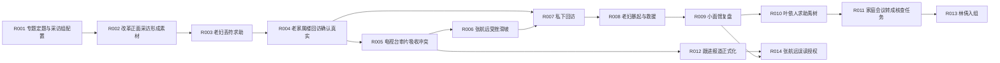

# C1-C5 事件重拆样稿 v0.1

## 1. 本次重拆目的

本文基于《事件拆分规则与智能体执行准则 v1.0》，重新拆分《致命采访》第二卷第一章至第五章的事件对象。

本文不是程序实现，也暂不改动基准时间轴投影数据集。它的用途是让用户审查：当前事件拆分规则是否能稳定地区分故事事件、剧情线投影和人物条。

## 2. 本次采用的拆分口径

### 2.1 只把“叙事状态变化”记录为事件

一个事件必须有输入、过程和输出。单纯场景描写、人物情绪、氛围、背景设定、后台持续状态，不单独拆成故事事件。

### 2.2 故事事件不因影响延续而拉长

事件时间范围只覆盖正文承载该事件的区间。后续仍在影响人物或剧情时，进入人物条、事件关系、章节输入或后台状态，不继续拉长原事件。

### 2.3 同一段正文可以拆成多个事件

如果同一场景中存在不同决策主体、不同冲突机制或不同输出，应拆开。

例如：

- 电视台把素材吸收成可播内容。
- 张航远被训斥后产生私人化失控风险。

两者发生相邻，但输出不同，因此应拆分。

### 2.4 剧情线条目不等于新增事件

“采访线推进”“证据线启动”“张航远线滑坡”是事件在某条剧情线上的投影或阶段说明。它们可以用于画布显示，但不应都塞进事件主记录里变成重复事件。

### 2.5 人物条不反向定义故事事件

人物条用于显示人物参与、后台消化、情绪延续和视角投射。只有当人物行动造成明确叙事变化时，才升级为事件。

## 3. C1-C5 核心事件重拆

以下 ID 为审查用候选 ID。确认后再映射到正式全局事件 ID。

| 候选ID | 章节 | 事件标题 | 主线归属 | 事件输入 | 事件过程 | 事件输出 | 拆分理由 |
|---|---|---|---|---|---|---|---|
| R001 | C1 | 皮革厂专题定题与采访组配置 | 电视台线 / 采访线 | 电视台确定皮革厂改革与员工持股深度专题，叶依人被重新推到前台。 | 熊丽借传播逻辑打压叶依人，并安排张航远成为选题助理。 | 叶依人重新进入记者位置，张航远进入采访组，采访工作具备组织前提。 | 这是后续所有采访行动的制度性起点。 |
| R002 | C1 | 改革正面采访形成可播素材 | 采访线 | 采访组进入皮革厂，专题预设是改革成果和员工持股。 | 杨心蕊和员工呈现正面改革效果，叶依人维持专业采访，张航远暗中补拍旧设备、边缘工人、粗糙双手等裂缝画面。 | 同一批素材同时形成“改革正面叙事”和“旧厂裂缝线索”。 | 它不是普通场景，而是制造了后续被电视台吸收和剪辑的素材状态。 |
| R003 | C1 | 老妇丢符求助撕开现场裂口 | 符与病患线 / 采访线 | 正面采访刚结束，改革叙事仍保持体面。 | 老妇因符纸丢失崩溃，抓住叶依人要求去家里看惨状；张航远示意摄影机重新开机。 | 采访对象从改革员工转向病患家属，符纸和病患家庭进入镜头。 | 冲突机制从正面采访变成异常求助，必须独立成事件。 |
| R004 | C2 | 老家属楼回访确认病患家庭真实 | 采访线 / 符与病患线 | 老妇把采访组带向厂区对面的老家属楼。 | 采访组进入逼仄小屋，看见病患丈夫和家庭困境；楼道窥视、威胁和邻里压力显现。 | 采访组确认惨状真实，但也确认继续拍摄有伦理风险和现场危险。 | 这是“口头控诉”转成“现场确认”的变化。 |
| R005 | C2 | 电视台审片吸收冲突并切割责任 | 电视台线 | 采访组带回正面改革、老妇冲突和老家属楼素材。 | 熊丽判断素材“有冲突，也有眼泪，能用”，同时训斥张航远、敲打叶依人，把风险责任压回采访组。 | 电视台确认素材价值，但明确保留剪辑权和责任切割姿态。 | 决策主体从采访组切换到电视台，输出也从现场事实变成媒体口径风险。 |
| R006 | C2 | 张航远受挫后私人化滑坡启动 | 张航远线 | 熊丽训斥让张航远感觉能力和价值被否定。 | 他离开电视台，转向娱乐场所和代偿式消费。 | 张航远的职业敏感与私人欲望开始合流，为后续越界和误读授权埋下风险。 | 这不是采访主线事件，但它是人物风险线的显性动作，不能只放在心理备注里。 |
| R007 | C3 | 张航远与叶依人分别私下回访 | 采访线 | 张航远想补充核实，叶依人担心老妇家安全。 | 张航远未申请正式手续，私下返回老家属区；叶依人也低调回访老妇。 | 两人都脱离正式采访流程进入同一危险现场。 | 这是“正式采访”转成“私人回访/暗访”的操作变化。 |
| R008 | C3 | 老妇暴起与张航远救援 | 符与病患线 / 张航远线 | 两人私下进入老妇家，老妇怀疑叶依人是杨家派来套话。 | 老妇突然失控攻击叶依人，张航远冲出救人并被烫伤，两人逃离现场。 | 现场失控被确认；张航远获得叶依人的短暂信任和感激；老妇问题不再只是贫困，而带有精神、药物或组织暗示疑点。 | 冲突机制从暗访核实变成安全失控，应独立成事件。 |
| R009 | C3 | 小面馆复盘把个案推向群体性职业病疑云 | 采访线 / 职业病证据线 | 张航远被救治后，两人有了短暂安全的复盘空间。 | 张航远复述巷口观察、病怏怏的人和“附近十几家”，并提出职业病群体现象判断。 | 叶依人被他的正义叙述刺中，但意识到此事牵涉杨家产业和改革旧账。 | 冲突机制从现场逃生变成事实解释与价值判断，输出指向 C4。 |
| R010 | C4 | 叶依人深夜求助禹树并被冷拆事实链 | 杨家旧账线 / 采访线 | 叶依人被旧厂苦难、张航远的勇气和杨家关系同时压住。 | 她凌晨约禹树到听溪茶舍倾诉；禹树不安慰，而是追问名单、诊断、病因、老妇暴起原因和电视台剪辑风险。 | 事件从情绪性苦难转成可核查事实链，叶依人第一次感到“冷静处理”与同情之间的断裂。 | 这是认知结构变化，不是单纯谈话场景。 |
| R011 | C4 | 家庭会议把采访问题转成旧账核查任务 | 杨家旧账线 / 职业病证据线 | 禹树要求开小范围家庭会议。 | 叶依人复述遭遇；老林交代皮革厂历史承诺和多年补贴；杨心蕊、莫妮卡和林倩分别从产业、家族和数据角度判断风险。 | 林倩提出名单、工龄、车间、症状、补贴和联系网络方案，旧厂问题成为杨家内部核查任务。 | 决策主体变成杨家内部，输出是调查结构，不应和 R010 合并。 |
| R012 | C5 | 熊丽将跟进报道正式化并限定口径 | 电视台线 / 采访线 | 前期素材被领导认可，电视台看见传播价值。 | 熊丽召集叶依人和张航远，安排一周跟进报道，要求多拍正面素材，负面线索可收集但不得提前定性职业病。 | 私下发现升级为正式任务，同时被电视台包装和控口径。 | 这是采访生命周期变化：从零散行动转为授权任务。 |
| R013 | C5 | 莫妮卡安排林倩入组建立保护和记录层 | 杨家旧账线 / 职业病证据线 | 叶依人坚持继续参与，莫妮卡担心她被病患、张航远和电视台剪辑裹挟。 | 莫妮卡要求林倩以个人助理身份随行，记录、拍照、整理名单，并私下汇报。 | 三人调查组形成；林倩成为证据线和家族保护层的入口。 | 决策主体和输出都不同于熊丽授权，应独立成事件。 |
| R014 | C5 | 张航远误读授权并夜间失控 | 张航远线 | 熊丽给他正式参与大稿子的机会，叶依人的鼓励强化了他的自我投射。 | 他把正式任务误读为正义被支持，夜间在私人空间发生失控行为，随后被勒索并损毁手机。 | 张航远的私人暴力风险和可被反制的把柄实体化。 | 这是人物风险线的重要事件；不属于采访主轴，但会影响后续张航远线。 |

## 4. 建议关系链

## 5. 从当前 JSON 中建议降级或迁移的条目

当前基准时间轴投影数据集把故事事件、剧情线投影和人物条都放在 `events[]` 里。后续真实数据建设时，建议按以下方式迁移。

| 当前条目类型 | 示例 | 建议归属 | 理由 |
|---|---|---|---|
| 主故事事件 | E001、E002、E003 | 事件主记录 | 这些是真正改变叙事状态的事件，但粒度需要按本稿拆细。 |
| 剧情线阶段说明 | I001、T001、F001、M003、P001、Z003 | 剧情线投影记录 | 它们多是某条线对事件的概括，不应全部当成新事件。 |
| 人物参与段 | CE-I-yiren-1、CE-Z-zhang-1 | 人物条参与记录 | 它们描述人物在某条线里的参与状态，不应和故事事件混表。 |
| 后台状态段 | CE-T-yiren-bg-1、CE-Z-yiren-bg-1 | 人物条后台段 | 正文没有持续呈现，不应拉长故事事件。 |
| 悬置问题 | T002、P001 的部分内容 | 章节输出 / 后续输入 | “附近十几家”“名单化方案”在 C1-C5 还不是完整走访事件，C6 才会变成样本走访事件。 |

## 6. 本次重拆对规则的检验

### 6.1 规则是可用的

按当前规则，C1-C5 不应只有 7 个大事件，也不应把每个剧情线阶段都当成事件。更合理的结果是：

- 14 个候选事件主记录。
- 若干剧情线投影。
- 若干人物条参与段和后台段。

这个粒度比“按章节拆”更细，比“按场景/动作拆”更稳。

### 6.2 最容易误拆的地方

1. C1 的“专题定题”和“正式采访”容易被合并，但它们输出不同：前者建立组织前提，后者产生素材状态。
2. C3 的现场失控不应被拆成多个刺激性动作；它只服务一个叙事变化：老妇失控和张航远救援。
3. C4 的听溪茶舍和家庭会议不能合并；前者是叶依人的认知降温，后者是杨家内部核查结构建立。
4. C5 的张航远夜间失控不属于采访主轴，但属于张航远线主事件，因为它制造了后续可被反制的风险实体。

### 6.3 对现有时间轴的影响

如果把本稿写回基准时间轴投影数据集，时间轴上应避免继续把 `I001/T001/P001/Z001` 这类投影条目直接当作主事件。更合适的显示方式是：

1. 事件主记录：用于 Inspector、事件详情、关系链。
2. 剧情线投影：用于在某条轨道上显示该事件与该线的关系。
3. 人物条：用于显示人物参与、后台消化和视角投射。

这样同一个事件可以被多条线引用，但不会出现“同一件事在多条线重复生成多个事件对象”的问题。

## 7. 待用户确认的问题

1. C1 是否接受把“改革正面采访形成可播素材”从“专题定题”中独立拆出？
2. C3 是否接受把“小面馆复盘”独立为事件，而不是归入“老妇暴起与救援”的结果字段？
3. C5 的“张航远夜间失控”是否作为张航远线主事件进入事件库，还是只进入人物条高风险段？
4. 后续写入 JSON 时，是否先建立事件主记录、剧情线投影和人物条三张分层数据，而不是继续混在 `events[]` 中？
